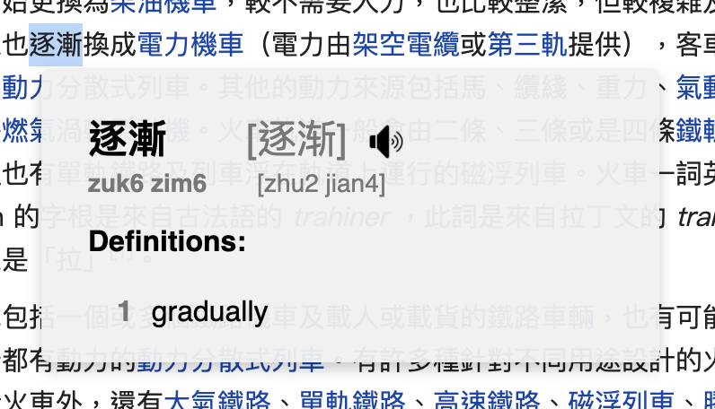
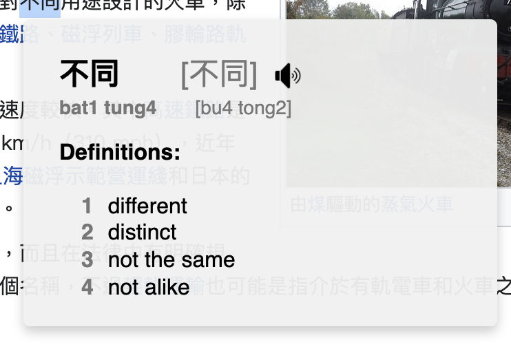
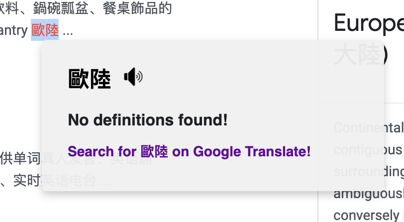

# CantoTranslate Chrome Extension

Learn Cantonese straight from your web browser!

Translates and speaks Cantonese from traditional Chinese words!

How to use:
* Simply **double click** on a word or phrase and definitions and Jyutping will appear!
* You can also click on the sound icon to hear the pronunciation in Cantonese!
* Any words without definitions will link you to a Google Translate link!

## Install and Develop

Currently not published to Chrome Web Store.

To install, please do the following:
1. Run `npm install` to install dependencies
1. Run `npm run build` to build the application into `dist` folder
1. Load `dist` folder into Chrome extensions to install extension

## Screenshots

  
  
  

---

## Limitations:

* This only supports Traditional Chinese as input
* Work in progress to support Simplified Chinese as input
* You can't translate hyperlinks; because the primary mode of input is a double click

---

## Credits

### Dependencies

* [WebSpeech 4.2](https://sourceforge.net/projects/e-guidedog/files/WebSpeech/)
  * This library isn't version controlled, and downloaded directly from Sourceforge

### Dictionaries

Definitions and readings were sourced from the following sites:

* cc-cedict: https://www.mdbg.net/chinese/dictionary?page=cc-cedict
  * [cedict dictionary download](https://www.mdbg.net/chinese/export/cedict/cedict_1_0_ts_utf-8_mdbg.txt.gz)
* cc-canto: https://cantonese.org/download.html
  * [ccanto dictionary download](https://cantonese.org/cccanto-170202.zip)
  * [cccedict-canto readings download](https://cantonese.org/cccedict-canto-readings-150923.zip)

### Development

* For the Chrome Extension Typescript React boilerplate: https://github.com/chibat/chrome-extension-typescript-starter
